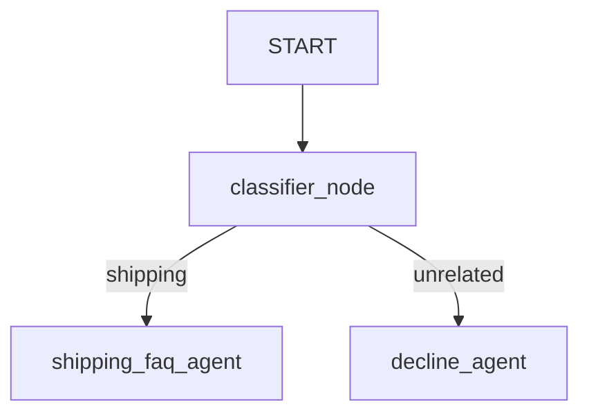

# Customer Support Agent

A graph-based workflow agent built using ADK 2.0 that acts as a customer support representative for a shipping company.

## Workflow Routing Design

The workflow routes user queries based on a classification decision:



1.  **`classifier_node`**: Receives the user query and runs a classifier agent to identify if it is related to shipping (rates, tracking, delivery, returns) or unrelated.
2.  **`shipping_faq_agent`**: If the query is related to shipping, this node answers the user query politely.
3.  **`decline_agent`**: If the query is unrelated to shipping, this node politely declines to answer the user query.

## Prerequisites

*   Python 3.10+ (Current project is built using Python 3.14.6)
*   Google GenAI API Key

## Setup and Installation

If you need to re-initialize the environment or install dependencies, run:

```bash
# Navigate to the project folder
cd customer_support_agent

# Activate virtual environment
# On Windows (cmd/powershell):
.venv\Scripts\activate

# Install dependencies
pip install -r requirements.txt
```

## Running the Agent

Configure your `GOOGLE_API_KEY` in the `.env` file first:
```env
GOOGLE_API_KEY=YOUR_ACTUAL_API_KEY
```

Then run the agent using the ADK CLI:

```bash
# From the project root (customer_support_agent folder):
.venv\Scripts\adk run . "What are your shipping rates?"
```

Or from the workspace root directory:
```bash
customer_support_agent\.venv\Scripts\adk run customer_support_agent "What are your shipping rates?"
```
